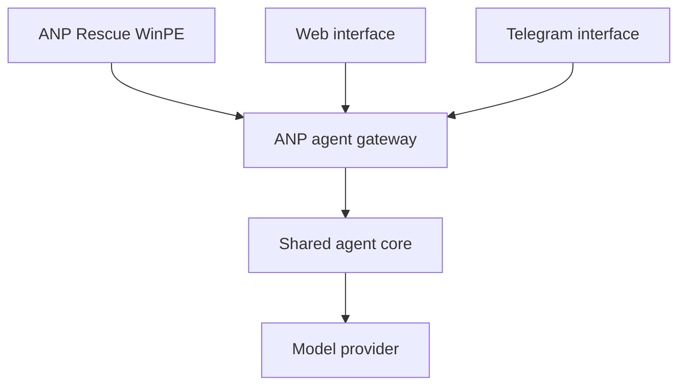

# Architecture

## System boundary

ANP Rescue is one interface to the shared ANP agent platform. Telegram, the website, and rescue media may share the same domain logic and backend, but each remains a replaceable router/client.

The rescue repository owns boot media composition, local diagnostics, report review, and execution of explicitly approved typed operations. It does not own general reasoning, API secrets, customer records, or the canonical repair knowledge base.

## Trust zones

| Zone | Contents | Rule |
| --- | --- | --- |
| Immutable image | Collector, launcher, schemas, public configuration | No reusable secrets or client data |
| Technician storage | Device token, exported reports, optional tool cache | Encrypt where practical; removable and revocable |
| Client machine | Disks, registry, logs, dumps | Read-only until a repair action is confirmed |
| ANP backend | API credentials, policy, model access, audit log | Authenticated, rate-limited, centrally revocable |

## Diagnostic flow

1. Boot WinPE and initialize wired networking.
2. Discover disks and offline Windows installations.
3. Run read-only collectors and create a versioned local report.
4. Preview/redact report fields locally.
5. Optionally submit approved data to the gateway.
6. Receive findings and proposed typed actions.
7. Preview the exact effect and require technician confirmation.
8. Execute locally and append the result to the audit log.

## Why Go for WinPE executables

Static Go binaries minimize runtime dependencies in WinPE, are easy to cross-compile for Windows x64, and work well for collectors and a small launcher. The shared backend can keep its existing stack; this repository deliberately does not force a backend rewrite.
