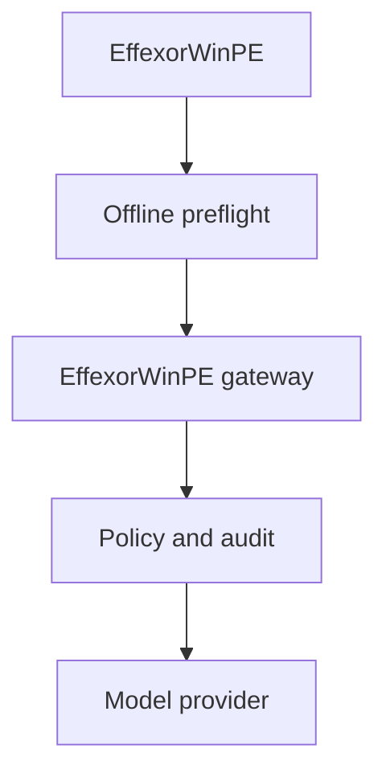

# Architecture

## System boundary

EffexorWinPE is a self-contained personal repair environment. Its boot media remains useful offline; optional model-backed reasoning is isolated behind a dedicated EffexorWinPE gateway so provider credentials never enter the ISO.

The repository owns boot media composition, local diagnostics, deterministic preflight, report review, the narrow gateway protocol, and server-side model policy. The ISO never owns provider credentials, customer records, or unrestricted model-generated execution.

## Trust zones

| Zone | Contents | Rule |
| --- | --- | --- |
| Immutable image | Collector, launcher, schemas, public configuration | No reusable secrets or client data |
| Technician storage | Device token, exported reports, optional tool cache | Encrypt where practical; removable and revocable |
| Client machine | Disks, registry, logs, dumps | Read-only until a repair action is confirmed |
| EffexorWinPE gateway | API credentials, policy, model access, ephemeral jobs | Authenticated, bounded, centrally revocable |

## Diagnostic flow

1. Boot WinPE and initialize wired networking.
2. Discover disks and offline Windows installations.
3. Run read-only collectors and create a versioned local report.
4. Produce a conservative offline preflight with evidence references and read-only next steps.
5. Preview/redact report fields locally.
6. Optionally submit approved data to the gateway.
7. Receive model-backed findings, retrieved sources, and proposed typed read-only actions.
8. Preview the exact effect and require technician confirmation.
9. Execute locally and append the result to the audit log.

## Why Go for WinPE executables

Static Go binaries minimize runtime dependencies in WinPE, are easy to cross-compile for Windows x64, and work well for collectors and a small launcher. The gateway uses the same dependency-light Go module for the MVP, while its provider interface keeps the client protocol independent of a specific model vendor.
